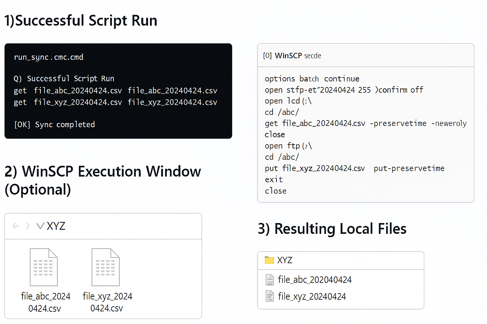

  
  
  
  
  
  
  

# sftp-ftp-sync-template

This repository provides a **sanitized WinSCP automation template** that demonstrates an **SFTP → local → FTP** file synchronization workflow using Windows batch scripting.

All sensitive credentials are injected via environment variables stored inside a local `secrets/secrets.cmd` file that is **not committed** to this repository.

---

## 📸 Screenshots

### ✔ Demo Output (Sample)

## 🚀 Features

- Automated file sync from **SFTP → local disk → FTP**
- Pure **WinSCP scripting** + Windows batch
- **Zero hardcoded credentials** (env‑var based)
- Safe, generic filenames (`file_abc_*`, `file_xyz_*`)
- Clean directory structure (`/abc/`, `C:\xyz\`)
- Optional GitHub Actions CI to detect accidental secrets

---

## 📁 Repository Structure
